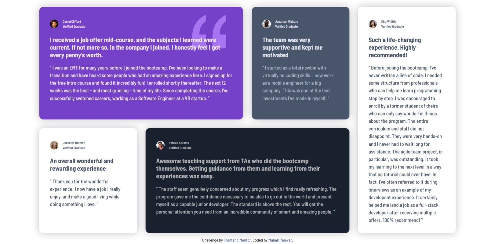

# Frontend Mentor - Testimonials grid section solution

This is a solution to the [Testimonials grid section challenge on Frontend Mentor](https://www.frontendmentor.io/challenges/testimonials-grid-section-Nnw6J7Un7). Frontend Mentor challenges help you improve your coding skills by building realistic projects. 

## Table of contents

- [Overview](#overview)
  - [Screenshot](#screenshot)
  - [Links](#links)
- [My process](#my-process)
  - [Built with](#built-with)
  - [Continued development](#continued-development)
- [Author](#author)
## Overview
It's the solution code of Testimonials grid section challenge.I built this solution with the help of AI tool copilot and with vs code extensions.Please feel free to give feedback on this project.

### Screenshot

### Links

- Solution URL:https://github.com/Mahak-Panwar/four-card-feature-section-master.git
- Live Site URL: https://mahak-panwar.github.io/four-card-feature-section-master/

## My Process

### Built with

- Semantic HTML5 markup
- CSS custom properties
- Flexbox
- CSS grid

### Continued development
I want to focus on how to build the project in minmium amont of time with the good technology.I would like to explore about the tools that help in bulding thw website more perfectly.

## Author
- Frontend Mentor - [@Mahak-Panwar](https://www.frontendmentor.io/profile/Mahak-Panwar)